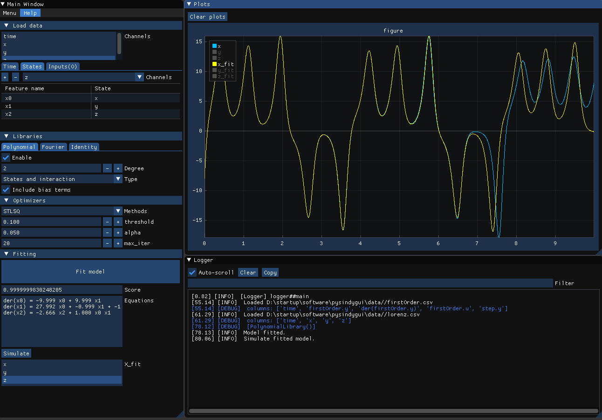

# PySINDyGUI

A graphical user interface for [PySINDy](https://github.com/dynamicslab/pysindy) package.



## Tutorial

To start the GUI:
```
git clone https://github.com/hyumo/pysindy-gui.git
cd pysindygui
pip install -r requirements.txt
python .
```

## Credits
- [PySINDy](https://github.com/dynamicslab/pysindy)
- [DearPyGui](https://github.com/hoffstadt/DearPyGui)